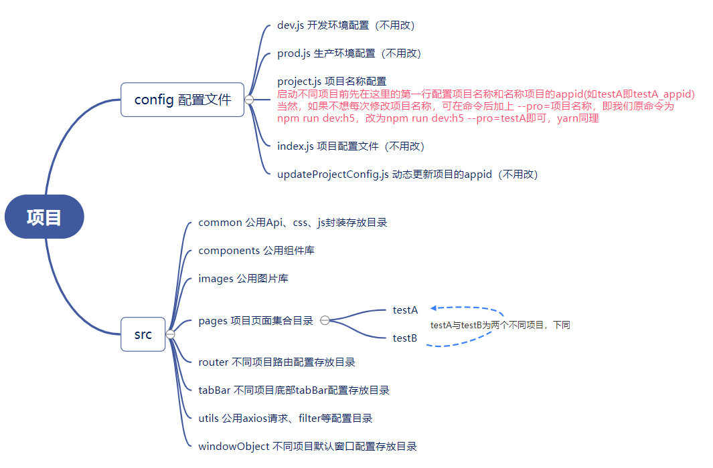

### taro + typescript + less + taro-hooks + eslint + webpack5的小程序集合项目

项目地址：https://github.com/ycy1621260121/taro_collections

```
项目背景：需在一套代码中集成多个小程序项目，组件共用、 可维护、拓展性高
设计思想：组件化，封装共用的css、js，按需引入，凡在代码结构上有差异的都以项目名称区分，各自独立，在指定js配置项目切换
拓展性：组件化可以实现不同组件任意组合，达到高拓展性，组件以驼峰形式命名，切忌拼音，便于维护
```
### 项目结构说明：

``` 
1、config:
    dev.js       //开发环境配置
    test.js      //测试环境配置
    prod.js      //生产环境配置
    project.js   //默认启动的项目名称，在第一行修改，启动前要么修改这里要么在启动命令上 --pro=项目名称（如npm run dev:h5 --pro=testA，即在原来默认指令加上）
    index.js     //项目配置文件

2、src
    common       //封装scss、api等可共用 
    components   //自定义组件库
    images       //图片文件
    pages        //项目页面集合目录
      testA      //项目testA
      testB      //项目testB，与testA为不同项目，他们都集中在这套代码里面
    router       //每个项目路由pages配置
    tabBar       //每个项目底部tabBar配置
    app.config.ts//项目路由配置
    app.less     //全局less
    app.ts       //主入口
```


taro-hooks文档：https://innocces.github.io/taro-hooks/#/
